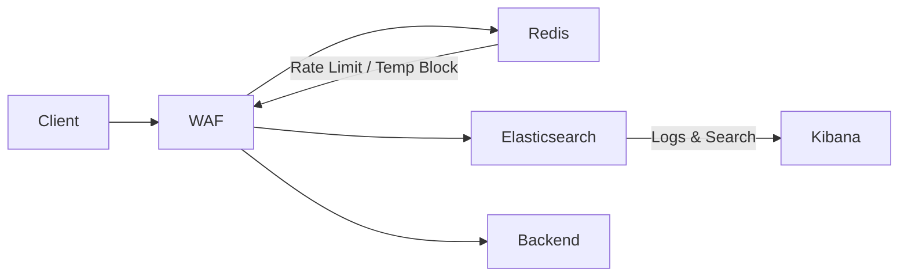
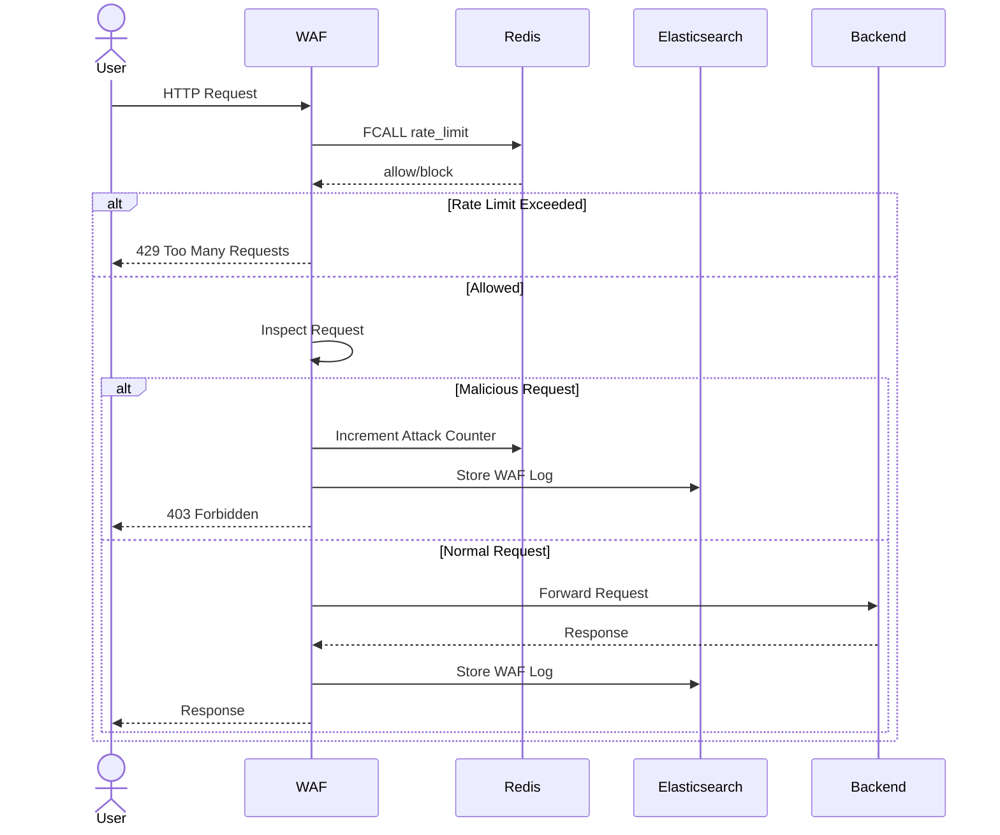
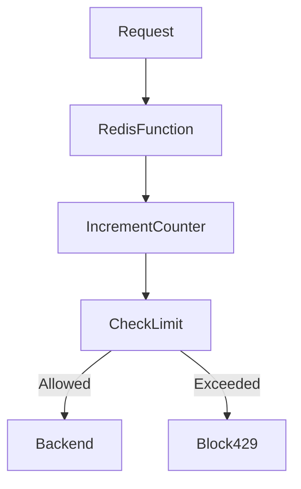

# Sample WAF (Web Application Firewall)

A simple learning-focused Web Application Firewall (WAF) built using Go, Redis, and Elasticsearch.

This project demonstrates:

* Reverse proxy based request flow
* Basic WAF rule inspection
* SQL Injection/XSS/Path Traversal detection
* Request scoring system
* Redis-based rate limiting
* Temporary IP blocking
* Redis Functions (Lua)
* Elasticsearch logging
* Docker-based local infrastructure

---

# Architecture



---

# Request Flow



---

# Features

## 1. Reverse Proxy WAF

The WAF acts as a reverse proxy.

All incoming requests:

* First hit the WAF
* Get inspected
* Then forwarded to backend if safe

Implemented using:

```go
httputil.NewSingleHostReverseProxy()
```

---

## 2. Rule Based Detection

The WAF checks requests against regex-based rules.

Current rules:

| Attack Type    | Example                  |
| -------------- | ------------------------ |
| SQL Injection  | `OR 1=1`, `UNION SELECT` |
| XSS            | `<script>`               |
| Path Traversal | `../`                    |

Each rule increases a request score.

---

## 3. Scoring System

Each matched attack rule adds score:

| Rule           | Score |
| -------------- | ----- |
| SQL Injection  | 50    |
| XSS            | 50    |
| Path Traversal | 40    |

If:

```text
score >= 50
```

The request is blocked.

---

## 4. Redis Rate Limiting

Redis is used for:

* Request counters
* Rate limiting
* Temporary IP blocking
* Fast in-memory state management

Rate limiting flow:



---

# Redis Function

A Redis Lua Function is used for atomic rate limiting.

Function responsibilities:

* Increment request count
* Set expiration
* Validate request limit
* Return allow/block decision

Example:

```lua
#!lua name=waflib

redis.register_function(
    'rate_limit',
    function(keys, args)

        local key = keys[1]
        local limit = tonumber(args[1])
        local window = tonumber(args[2])

        local current = redis.call('INCR', key)

        if current == 1 then
            redis.call('EXPIRE', key, window)
        end

        if current > limit then
            return 0
        else
            return 1
        end
    end
)
```

---

# Why Redis Function?

Instead of:

```text
Go App -> INCR
Go App -> EXPIRE
Go App -> Check Count
```

The Redis Function performs everything atomically inside Redis.

Benefits:

* Fewer network calls
* Faster execution
* Atomic operations
* Better scalability
* Production-style architecture

---

# Elasticsearch Logging

All requests are logged into Elasticsearch.

Stored information:

* Timestamp
* IP
* Method
* Path
* Query
* Score
* Action
* Matched Rules
* User Agent

Example index:

```text
waf-logs
```

---

# Docker Setup

## Run Elasticsearch

```bash
docker run -d \
  --name elasticsearch \
  -p 9200:9200 \
  -e "discovery.type=single-node" \
  -e "xpack.security.enabled=false" \
  docker.elastic.co/elasticsearch/elasticsearch:8.13.4
```

---

## Run Redis

```bash
docker run -d \
  --name redis \
  -p 6379:6379 \
  redis/redis-stack-server:latest
```

---

# Load Redis Function

```bash
cat rate_limit.lua | docker exec -i redis redis-cli -x FUNCTION LOAD REPLACE
```

Verify:

```bash
docker exec -it redis redis-cli
```

```redis
FUNCTION LIST
```

---

# Run Backend Server

```bash
go run backend.go
```

Backend runs on:

```text
localhost:8081
```

---

# Run WAF

```bash
go run main.go
```

WAF runs on:

```text
localhost:8080
```

---

# Testing

## Normal Request

```bash
curl http://localhost:8080
```

---

## SQL Injection Test

```bash
curl "http://localhost:8080/login?user=admin%27%20OR%201%3D1--"
```

Expected:

```text
403 Forbidden
```

---

## Rate Limit Test

```bash
for i in {1..25}; do curl http://localhost:8080; done
```

Expected after threshold:

```text
429 Too Many Requests
```

---

# Redis Concepts Learned

This project demonstrates:

| Concept           | Usage                 |
| ----------------- | --------------------- |
| Strings           | Counters              |
| TTL               | Rate limit expiry     |
| Redis Functions   | Atomic logic          |
| In-memory storage | Fast request handling |
| Persistence       | Optional durability   |

---

# Future Improvements

Possible upgrades:

* JWT validation
* GeoIP blocking
* Redis Streams
* Pub/Sub alerting
* Kibana dashboard
* Rule management API
* Distributed WAF nodes
* IP reputation system
* Sliding window rate limiting
* Machine learning anomaly detection

---

# Tech Stack

| Component        | Technology    |
| ---------------- | ------------- |
| Language         | Go            |
| Cache / State    | Redis         |
| Search / Logs    | Elasticsearch |
| Containerization | Docker        |
| Reverse Proxy    | Go net/http   |

---

# Learning Outcome

This project helps understand:

* WAF request lifecycle
* Reverse proxy architecture
* Redis-based rate limiting
* Atomic backend operations
* Elasticsearch logging pipeline
* Dockerized infrastructure
* Production-inspired backend patterns
