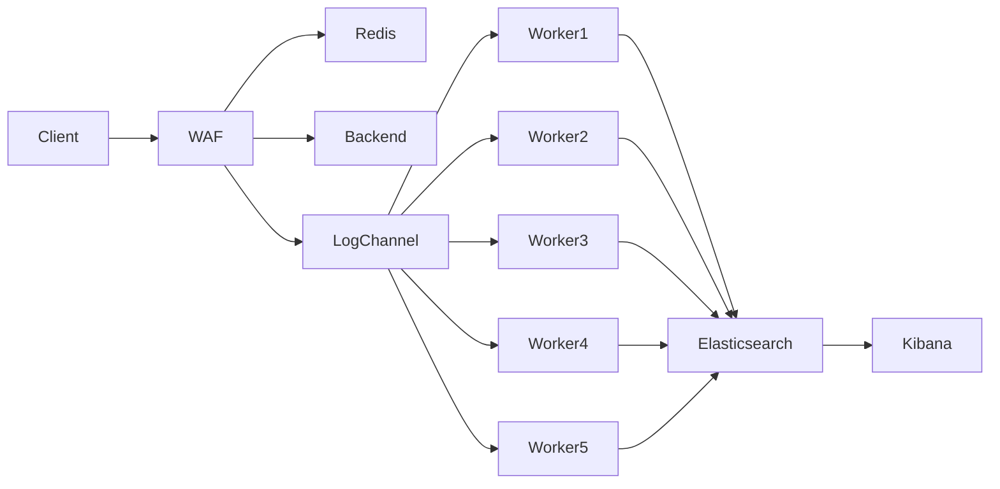
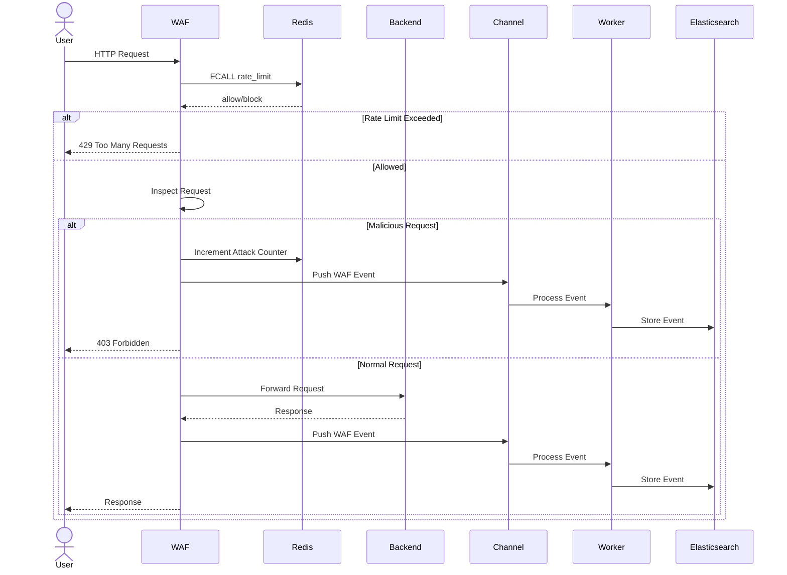

# Sample WAF (Web Application Firewall)

A learning-focused Web Application Firewall (WAF) built using Go, Redis, Elasticsearch, and Docker.

The project demonstrates how a modern reverse-proxy based WAF can perform:

- Request inspection
- Rate limiting
- Temporary IP blocking
- Attack detection
- Structured logging
- Asynchronous log processing
- Elasticsearch integration
- Unit testing with mocks

---

# Features

## Reverse Proxy

Acts as a reverse proxy in front of backend services.

```text
Client -> WAF -> Backend
```

Built using:

```go
httputil.NewSingleHostReverseProxy()
```

---

## Attack Detection

The WAF inspects:

- URL Path
- Query Parameters
- Request Body
- Headers

Supported detections:

| Attack Type | Example |
|-------------|----------|
| SQL Injection | OR 1=1 |
| XSS | <script> |
| Path Traversal | ../ |

---

## Request Scoring

Every rule contributes to a score.

| Rule | Score |
|--------|--------|
| SQL Injection | 50 |
| XSS | 50 |
| Path Traversal | 40 |

Requests are blocked when:

```text
Score >= 50
```

---

## Redis-Based Rate Limiting

The WAF uses Redis for:

- Rate limiting
- Temporary IP blocking
- Attack counters
- Fast in-memory state

Current configuration:

```text
20 requests / 60 seconds
```

Exceeded requests receive:

```http
429 Too Many Requests
```

---

## Redis Functions

Rate limiting logic runs directly inside Redis using Redis Functions.

Benefits:

- Atomic execution
- Reduced network calls
- Faster processing
- Production-style architecture

### Function

```lua
#!lua name=waflib

redis.register_function(
    'rate_limit',
    function(keys, args)

        local key = keys[1]
        local limit = tonumber(args[1])
        local window = tonumber(args[2])

        local current = redis.call('INCR', key)

        if current == 1 then
            redis.call('EXPIRE', key, window)
        end

        if current > limit then
            return 0
        else
            return 1
        end
    end
)
```

---

## Temporary IP Blocking

Malicious requests increment an attack counter.

After multiple malicious attempts:

```text
3 attacks -> IP blocked for 1 minute
```

Redis stores:

```text
attacks:<ip>
blocked:<ip>
```

---

## Structured Logging

The project uses:

```text
zerolog
```

for structured application logs.

Example:

```json
{
  "level":"info",
  "method":"GET",
  "path":"/login",
  "score":50,
  "message":"request inspected"
}
```

---

## Asynchronous Log Processing

Instead of writing directly to Elasticsearch during request processing:

```text
Request
  ↓
Channel
  ↓
Worker Pool
  ↓
Elasticsearch
```

This prevents Elasticsearch latency from affecting request handling.

---

# Architecture



---

# Request Flow



---

# Project Structure

```text
samplewaf/

├── cmd/
│   └── waf/
│       └── main.go

├── internal/
│   ├── adapters/
│   │   ├── redis.go
│   │   └── elasticsearch.go
│   │
│   ├── config/
│   │   └── config.go
│   │
│   ├── middleware/
│   │   └── logging.go
│   │
│   ├── models/
│   │   └── waf_event.go
│   │
│   ├── proxy/
│   │   └── proxy.go
│   │
│   ├── utils/
│   │   └── ip.go
│   │
│   ├── waf/
│   │   ├── handler.go
│   │   ├── rules.go
│   │   ├── inspector.go
│   │   ├── handler_test.go
│   │   └── mock_test.go
│   │
│   └── workers/
│       └── elastic_worker.go
│
├── scripts/
│   └── rate_limit.lua
│
├── backend/
│   └── main.go
│
└── README.md
```

---

# Elasticsearch Events

The WAF stores events such as:

```json
{
  "timestamp":"2026-06-01T14:32:03Z",
  "ip":"127.0.0.1",
  "method":"GET",
  "path":"/login",
  "score":50,
  "action":"block",
  "rules":["SQL Injection"],
  "user_agent":"curl/8.5.0"
}
```

Index:

```text
waf-logs
```

---

# Running Redis

```bash
docker run -d \
  --name redis \
  -p 6379:6379 \
  redis/redis-stack-server:latest
```

---

# Load Redis Function

```bash
cat scripts/rate_limit.lua | docker exec -i redis redis-cli -x FUNCTION LOAD REPLACE
```

Verify:

```bash
docker exec -it redis redis-cli
```

```redis
FUNCTION LIST
```

---

# Running Elasticsearch

```bash
docker run -d \
  --name elasticsearch \
  -p 9200:9200 \
  -e "discovery.type=single-node" \
  -e "xpack.security.enabled=false" \
  docker.elastic.co/elasticsearch/elasticsearch:8.13.4
```

---

# Run Backend

```bash
go run backend/main.go
```

Runs on:

```text
localhost:8081
```

---

# Run WAF

```bash
go run cmd/waf/main.go
```

Runs on:

```text
localhost:8080
```

---

# Testing

Run all tests:

```bash
go test ./...
```

Run WAF tests only:

```bash
go test ./internal/waf
```

Current test coverage includes:

- Rate limiting
- Blocked IPs
- SQL Injection detection
- XSS detection
- Path traversal detection
- Normal requests

---

# Future Improvements

- Sliding Window Rate Limiter
- Redis Streams
- Pub/Sub Alerts
- GeoIP Blocking
- JWT Validation
- Kibana Dashboards
- Dynamic Rule Management
- Distributed WAF Nodes
- IP Reputation Scoring
- Machine Learning Anomaly Detection

---

# Tech Stack

| Component | Technology |
|------------|------------|
| Language | Go |
| Cache | Redis |
| Search & Analytics | Elasticsearch |
| Logging | Zerolog |
| Reverse Proxy | net/http |
| Testing | Testify |
| Containerization | Docker |

---

# Learning Outcomes

This project covers:

- Reverse Proxy Architecture
- WAF Request Lifecycle
- Redis Data Structures
- Redis Functions
- Rate Limiting Strategies
- Temporary IP Blocking
- Worker Pools
- Structured Logging
- Elasticsearch Integration
- Dependency Injection
- Interface-Based Design
- Unit Testing with Mocks
- Dockerized Development Environment